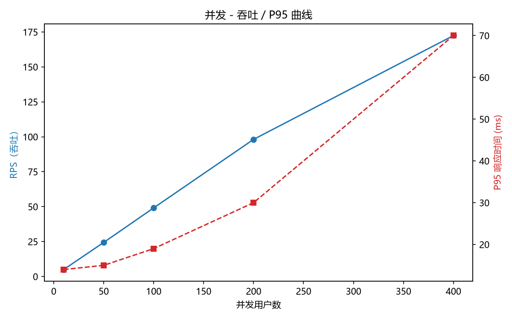

# demo-api 性能测试报告

## 1. 测试目标
验证任务管理接口在不同并发下的吞吐与响应时间，找出性能拐点，验证多进程部署的收益。

## 2. 测试环境
| 项目 | 内容 |
|------|------|
| 测试机 | Windows 11 / Intel Iris Xe / 内存 xx GB |
| 被测服务 | FastAPI + uvicorn（单进程），SQLite 存储 |
| 压测工具 | Locust 2.46.x（与压测机同机，属单机压测） |
| 脚本 | locustfile.py（读:写:异常 = 5:1:2） |

## 3. 测试场景
| 场景 | 并发 | 持续时间 |
|------|------|----------|
| 基准 | 10 | 2 分钟 |
| 负载 | 50 / 100 | 各 2 分钟 |
| 压力 | 200 / 400 | 各 2 分钟 |
| 优化验证 | 200（4 workers） | 2 分钟 |

## 4. 结果数据
（粘贴 summary.csv 生成的表格）
并发用户数	RPS	P50(ms)	P95(ms)	请求总数	失败数
10	 4.99	7	14	594                      135
50	24.36	7	15	2895	                    739
100	49.09	7	19	5826	                  1413
200	98.13	8	30	11632	                   2853
400	172.42	13	70	   20543	               4920

## 5. 曲线
（插入 reports/curve.png）

## 6. 结论
- 拐点出现在约 xxx 并发：RPS 从 xx 降到 xx，P95 从 xx ms 劣化到 xx ms
- 瓶颈初步判断：单进程 uvicorn（CPU 单核打满）+ SQLite 写锁
- 优化验证：改为 4 workers 后，200 并发下 RPS 提升 xx%，P95 下降 xx%

## 7. 说明与局限
- 压测机与被测服务同机，结果会受本机资源竞争影响
- 脚本中包含一条"查不存在的 id"的用例，其失败属于已知缺陷 D2，不计入性能失败率