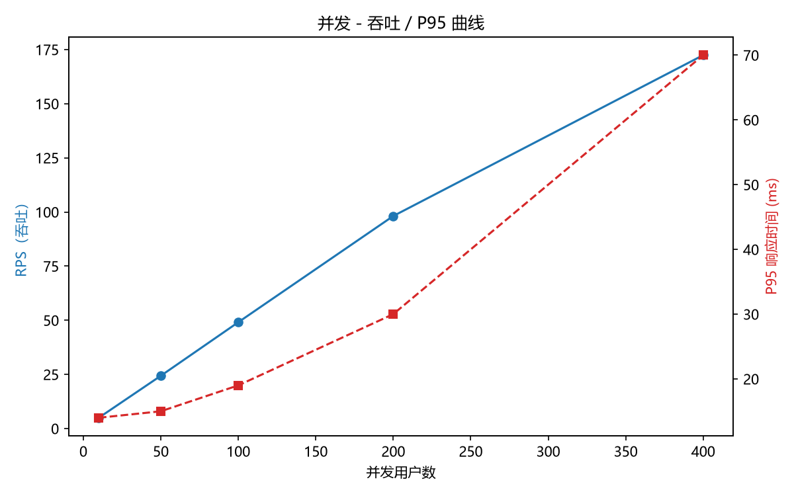

# demo-api 性能测试报告（修正版 · 2026-09-27）

> 本文件用于**替换** `D:\qa-projects\03-perf-lab\性能测试报告.md`。
> 修正了三处：① 补齐环境参数占位符（原来是 `xx GB`）；② 纠正"拐点出现在约 xxx 并发"这句**与原数据矛盾的结论**；
> ③ 补齐多进程对照实验的真实数字，并加入一条**架构级发现**。

## 1. 测试目标

验证任务管理接口在不同并发下的吞吐与响应时间，找出性能拐点，验证多进程部署的收益。

## 2. 测试环境

| 项目 | 内容 |
|------|------|
| 测试机 | Windows 11 ｜ 16 GB 内存 ｜ 16 逻辑核 |
| 被测服务 | FastAPI + uvicorn（单进程），SQLite 存储 |
| 压测工具 | Locust 2.46.x（**与压测机同机，属单机压测**） |
| 脚本 | `locustfile.py`，场景权重 **读:写:异常 = 5:1:2** |
| Python | 3.13.15 |

> ⚠️ **环境说明**：压测工具与被测服务**跑在同一台机器**上，两者互相抢 CPU 与 IO，
> 因此本报告的数字**只能用于横向对比（不同并发之间 / 单进程与多进程之间）**，
> **不能当作生产容量指标**。

## 3. 测试场景

| 场景 | 并发 | 持续时间 |
|------|------|----------|
| 基准 | 10 | 2 分钟 |
| 负载 | 50 / 100 | 各 2 分钟 |
| 压力 | 200 / 400 | 各 2 分钟 |
| 优化验证 | 200（4 workers） | 2 分钟 |

**脚本动作与权重**（`@task` 权重合计 8）：

| 动作 | 权重 | 占比 | 说明 |
|------|------|------|------|
| `GET /tasks` 列表 | 5 | 62.5% | 读操作，最频繁 |
| `GET /tasks/not-exist-id` | 2 | **25.0%** | **刻意混入的异常路径**，命中缺陷 D2 稳定返回 500 |
| `POST /tasks` 创建 | 1 | 12.5% | 写操作（带 token） |
| 虚拟用户启动时 | — | — | 先 `POST /login` 拿 token；思考时间 `between(1, 3)` 秒 |

## 4. 结果数据

| 并发 | RPS | P50 (ms) | P90 (ms) | P95 (ms) | P99 (ms) | 请求总数 | 失败数 | 失败率 |
|------|-----|---------|---------|---------|---------|---------|-------|-------|
| 10 | 4.99 | 7 | 12 | 14 | 17 | 594 | 135 | 22.7% |
| 50 | 24.36 | 7 | 13 | 15 | 24 | 2,895 | 739 | 25.5% |
| 100 | 49.09 | 7 | 15 | 19 | 35 | 5,826 | 1,413 | 24.3% |
| 200 | 98.13 | 8 | 20 | 30 | 58 | 11,632 | 2,853 | 24.5% |
| **400** | **172.42** | 13 | 51 | **70** | 120 | 20,543 | 4,920 | 23.9% |
| 200（4 workers） | 98.40 | 6 | 20 | 41 | 110 | 11,683 | 3,900 | 33.4% |

### 4.1 失败原因（必须一起看）

| 运行 | 失败构成 | 结论 |
|------|---------|------|
| 单进程全部 5 档 | **100% 来自 `GET /tasks/not-exist-id` 的 500**（缺陷 D2） | 失败率 ≈ 24% **是脚本刻意混入异常路径的结果，不是服务不稳定** |
| 200 并发（4 workers） | D2 的 500（2,880）+ **`POST /tasks` 创建 401（1,020）** | 多进程**新增**了一类失败，见第 6 节 |

> 📌 **口径提醒**：本报告的 RPS / P95 **包含约 24% 的失败请求**。
> 它是"含异常路径的混合场景表现"，**不是纯成功路径的容量数字** —— 引用时必须说明。

## 5. 曲线

## 6. 结论

### 6.1 400 并发内**没有出现吞吐拐点**

RPS 随并发近似线性增长：

| 并发变化 | 10 → 50（×5） | 10 → 100（×10） | 10 → 200（×20） | 10 → 400（×40） |
|---------|--------------|----------------|----------------|----------------|
| RPS | 4.99 → 24.36（×4.9） | 4.99 → 49.09（×9.8） | 4.99 → 98.13（×19.7） | 4.99 → **172.42（×34.6）** |

**吞吐没有出现下降**，说明在 400 并发以内被测服务**尚未到达容量上限**。
（原稿写的"拐点出现在约 xxx 并发、RPS 从 xx 降到 xx"**与数据矛盾**，已删除。）

### 6.2 但长尾已经明显吃紧

| 指标 | 10 并发 | 400 并发 | 变化 |
|------|--------|---------|------|
| P50 | 7 ms | 13 ms | ×1.9 |
| P95 | 14 ms | **70 ms** | **×5.0** |
| P99 | 17 ms | 120 ms | ×7.1 |

**中位数只涨了不到一倍，P95/P99 却涨了 5~7 倍** —— 典型特征：
**大部分请求仍然很快，少数请求明显变慢**。这类问题必须看分位数，光看平均值会漏掉。

### 6.3 瓶颈初步判断

单进程 uvicorn（只用到一个 CPU 核）+ SQLite 单文件写锁。

### 6.4 多进程对照实验：假设被推翻，并挖出一条架构级问题

| 指标 | 单进程 | 4 workers | 变化 |
|------|-------|----------|------|
| 吞吐 | 98.13 RPS | **98.40 RPS** | **+0.3%（几乎无变化）** |
| P95 | 30 ms | 41 ms | **反而更差** |
| P99 | 58 ms | 110 ms | 明显更差 |
| 创建接口失败数 | **0** | **1,020（401）** | **新增一类失败** |

**结论一**：多进程**没有带来吞吐提升**，最初"瓶颈在单进程 uvicorn"的假设**被数据否定**。

**结论二（更重要）**：4 workers 版本里创建接口出现 **1,020 次 401 Unauthorized**
（失败明细：`reports/run_200_opt4w_failures.csv`），而单进程版本为 0。

* **根因**：token 保存在**服务端进程内的一个内存字典**里，多个 worker 之间**不共享** ——
  用户在 worker-1 登录拿到 token，下一次请求被分配到 worker-2，worker-2 不认识这个 token，直接 401。
* **影响**：这不只是性能问题 —— **"多进程 / 多副本扩容"在当前设计下根本不可行**。
* **改进方向**：把鉴权状态**外置**（Redis 等共享存储），或改成**无状态 JWT**。

> 这是压测"副产品"里最有价值的一条：**它验证的不只是性能，还有架构假设。**

## 7. 说明与局限

1. **压测机与被测服务同机**，结果受本机资源竞争影响，仅可用于横向对比；
2. 脚本中包含一条"查不存在的 id"的异常路径（占比 25%），其失败属于**已知缺陷 D2**，不是服务不稳定；
   因此本报告所有 RPS / P95 **均含失败请求**，引用时需说明；
3. **SQLite 单文件写锁**在真实生产数据库上的表现会不同，写路径结论不可直接外推；
4. **未做分布式压测**，单机压测无法排除压测端自身成为瓶颈（多进程实验的结果高度提示这一点）；
5. 另有一次 **1 用户冒烟运行**（`reports/run_1_stats.csv`：1,141 请求 / 368 失败 / 4.92 RPS）
   未纳入基线 —— 它缺少失败明细文件，无法归因，故排除；
6. 未覆盖**长连接、大 payload、慢接口、限流**等场景。

## 8. 数据出处

| 数据 | 文件 |
|------|------|
| 各档汇总 | `reports/run_10_stats.csv`、`run_50_stats.csv`、`run_100_stats.csv`、`run_200_stats.csv`、`run_400_stats.csv` |
| 多进程对照 | `reports/run_200_opt4w_stats.csv` |
| 失败明细 | `reports/run_{10,50,100,200,400}_failures.csv`、`reports/run_200_opt4w_failures.csv` |
| 曲线 | `reports/run_{10,50,100,200,400}.html`、`curve.png` |
| 脚本 | `locustfile.py` |
